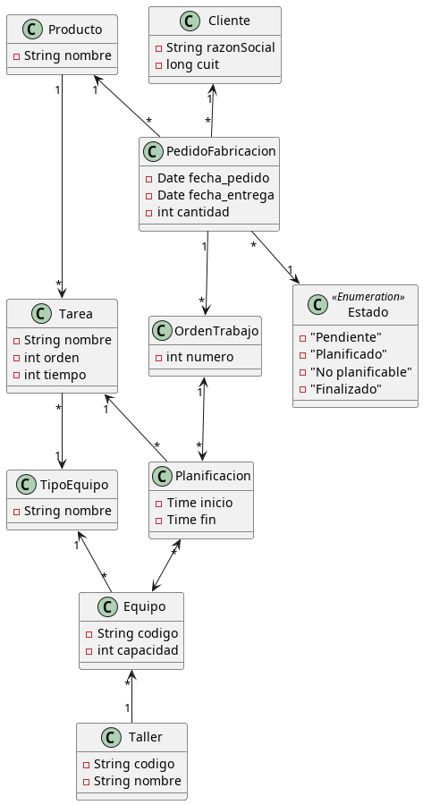

### Laboratorio de Programación y Lenguajes
### Trabajo Práctico
# MRP Lite

Para la instalación y configuración del entorno de desarrollo es necesario seguir el siguiente 
<a href="https://git.fi.mdn.unp.edu.ar/labprog/core/infraestructura-tps/-/blob/master/README.md" target="_blank">INSTRUCTIVO</a>

---

## Problema Planteado
La empresa Gorpbal S.R.L. se especializa en la fabricación de productos para la industria.
Gorpbal cuenta con múltiples talleres distribuidos en la zona para cubrir la demanda de sus clientes, la que va en incremento gracias a la calidad de sus productos.

Para cumplir con los estándares establecidos e incrementar la eficiencia de sus procesos, la empresa solicita un sistema informático que le de soporte a la administración de los recursos y la planificación de los pedidos entrantes.

## Objetivo de solución
Proveer a Gorpbal una herramienta de control y gestión para los pedidos y procesos de fabricación de los productos en su catálogo.

La solución debe administrar el catálogo de productos con los detalles del proceso de fabricación.
Además, debe contar con un registro de los talleres y el equipamiento que contienen.
Es necesario también recibir los pedidos de fabricación de productos de los clientes.
Finalmente, la funcionalidad fundamental requerida por Gorpbal es la de realizar la planificación de las tareas; esto es, encargarse de secuenciar las tareas del proceso de fabricación de productos en los talleres adecuados para cumplir con las fechas de entrega estipuladas de todos los pedidos.

## La solución requiere
### Administración de talleres
La solución contará con una administración básica de los talleres y sus equipos, incluida la carga de los tipos de equipo.

Aquí se deben poder realizar Altas, Bajas, Modificaciones y Consultas de los Tipos de equipo, los talleres y los equipos de cada uno.

Se debe tener en cuenta, que los equipos de un mismo tipo podrían tener distintas capacidades de productividad (unidades de trabajo por hora).

### Administración de especificaciones de productos
Del mismo modo que con los talleres, se debe poder administrar el catálogo de productos mediante las especificaciones de producto a través de las tareas de fabricación.
Cada tarea debe indicar la cantidad de unidades de trabajo requeridas para ser completada (capacidad requerida).

Altas, Bajas, Modificaciones y Consultas son requeridas para las mismas, proveyendo una vista master-detail.

### Administración de Clientes
Se deben poder administrar los clientes registrados.

Altas, Bajas, Modificaciones y Consultas son requeridas.

### Administración de pedidos de fabricación
El sistema debe contar con un módulo de adminsitración de pedidos donde se reciban los mismos y se observe la trazabilidad de su estado.
Los estdos posibles de los pedido pueden ser: pendiente, planificado, no planificable y finalizado.

La pantalla de carga y consulta de pedidos debe ser ágil debido a que su operación debe procesarse en respuesta a pedido del cliente en vivo, en una situación donde este se encuentra en persona o por comunicación telefónica.
Es importante por esto que dicha pantalla tenga las funcionalidades necesarias para avanzar, retroceder, cancelar o modificar el actual pedido de fabricación.

Debe existir un proceso que luego de cada proceso de planificación emita un e-mail indicando al cliente el resultado de la planificación.
Se debe contar con una pantalla que permita verificar los pedidos filtrando por su estado.
En particular, poder revisar los no planificables contando con la alternativa que se indica en el proceso de planificación.

### Proceso de planificación de fabricación
El sistema debe contar con un proceso automático, al final del día, que realice la planificación de tareas para satisfacer el pedido de fabricación, cumpliendo con los siguientes requisitos:
* Se debe generar una orden de trabajo por producto a fabricar.
* Todas las tareas necesarias para la fabricación del producto deben completarse antes de la fecha de entrega del pedido de fabricación.
* Todas las tareas de una orden de fabricación deben realizarse en un mismo taller.
* En caso de que un pedido de fabricación no pueda ser planificado debido a la ocupación de los talleres, el sistema debe dar la oportunidad de renegociar la fecha de entrega con el cliente, sugiriendo alguna de las siguientes opciones: modificar el pedido de fabricación completa para una fecha que pueda ser planificada; dividir el pedido de fabricación en dos, indicando la cantidad productos que pueden entregarse en la fecha deseada en uno y la fecha de entrega para el resto en el otro. Esto debe quedar registrado en el pedido indicando el estado no planificable.
* El proceso debe contemplar la situación en que se procesan pedidos todos los días y que las fechas solicitadas no ingresan de forma ordenada e incremental, por lo tanto el proceso debe optimizar o replanificar las tareas para poder cumplir con los nuevos pedidos que quizas requieran fechas más tempranas de entrega a los ya planificados.
* Las replanificaciones necesarias pueden cambiar las fechas de la realización de las tareas, pero en ningún caso pueden comprometar la fecha de entrega de entrega del pedido si este ya fue planificado y comprometido con le cliente.

### Visualización de planificación de los talleres.
Con fines de gestión, el sistema debe contar con una visualización de las planificaciones de los talleres, presentando de forma gráfica las tareas en cada equipo en el tiempo como se muestra en la figura.
Esta visualización debe mostrar la planificación de una semana completa, pero debe poder observarse un periodo deseado (ej. a partir del 10/5/2016).

## Criterio de satisfacción

### Ejemplo de uso y validaciones
La verificación de calidad se realizará utilizando las siguientes premisas para un conjunto de pruebas a realizar:
* Al menos 5 talleres, contando con equipamiento redundante entre ellos y de distintas capacidades.
* No todos los talleres deben contar con el mismo equipamiento.
* Al menos 50 pedidos en un periodo de 3 meses. Los 50 pedidos deben estar distribuidos en 5 días de carga distintos, de forma no homogenea, garantizando la no secuencialidad de las fechas de entrega de los mismos.
* Los pedidos deben contemplar, varias unidades del producto a fabricar de forma no homogenea.
* El catalogo de contar con al menos 10 tipos de productos con distintos conjuntos de tareas. También, los productos deben garantizar la superposición parcial del uso de los equipos.

